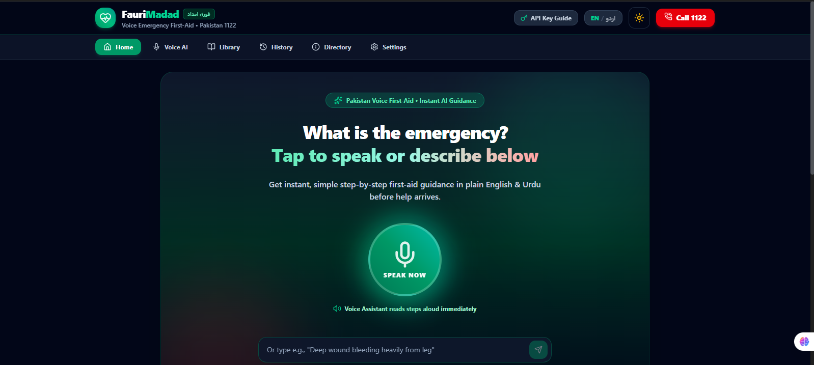
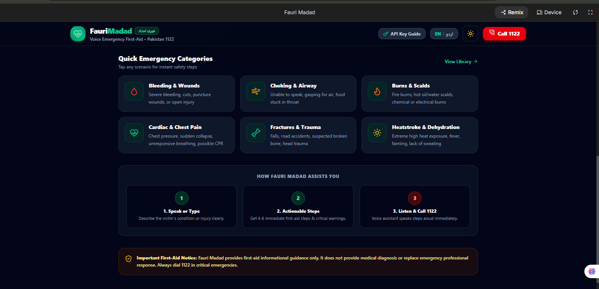
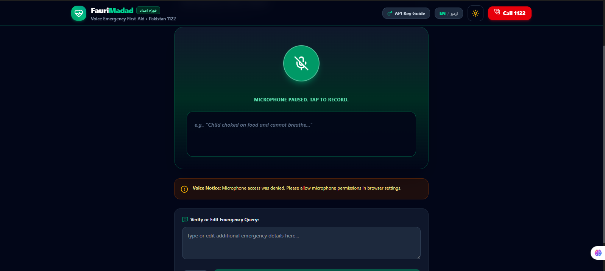
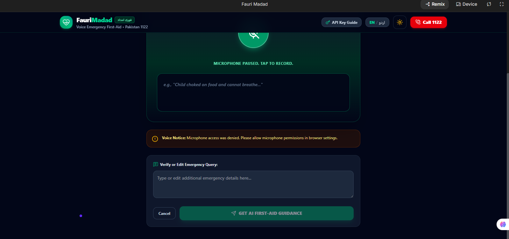
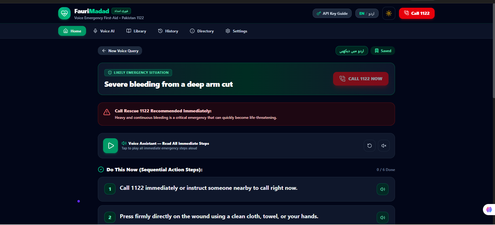
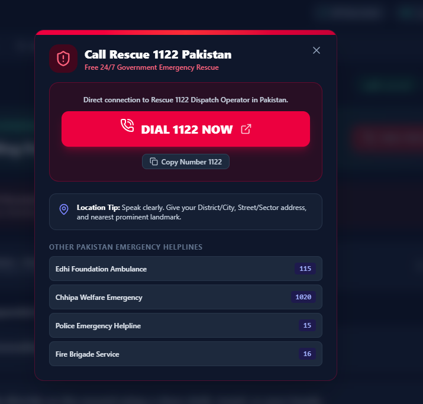
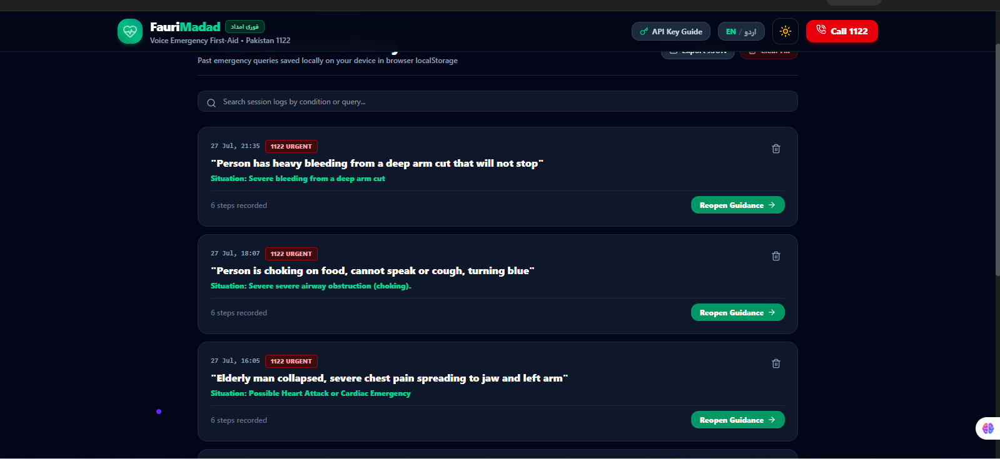
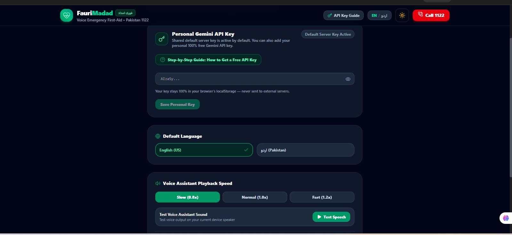
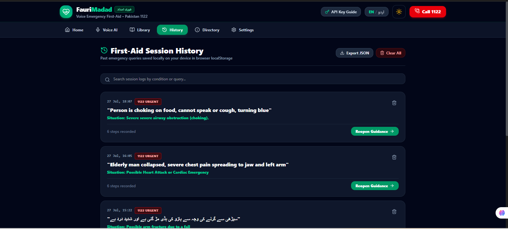
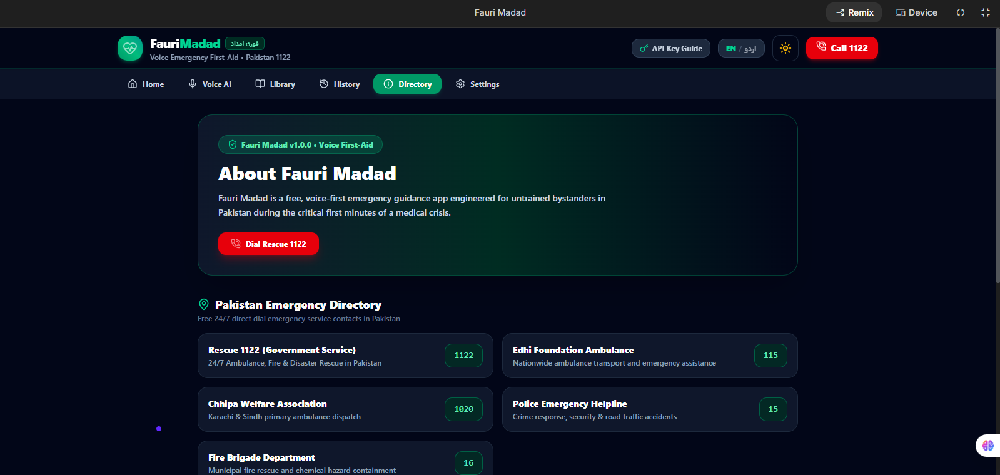

# 🚑 Fauri Madad (فوری امداد)

### **AI-Powered Voice-First Emergency First-Aid Assistant for Pakistan**

<p align="center">


</p>

---

## 🌍 About the Project

**Fauri Madad** is an AI-powered, voice-first emergency first-aid web application designed to help people respond quickly and confidently during medical emergencies. Instead of searching multiple websites or relying on unreliable information while under stress, users can simply **speak or type their emergency** in **Urdu or English** and instantly receive structured, easy-to-follow first-aid guidance generated by **Google Gemini AI**.

The platform combines **Artificial Intelligence, Voice Recognition, Text-to-Speech, and Emergency Response Resources** into a single intuitive interface, making life-saving guidance faster, more accessible, and easier to understand for everyone—especially untrained bystanders.

> **Mission:** Empower every person in Pakistan with immediate, AI-assisted first-aid guidance until professional medical help arrives.

---

> ⚠️ **Disclaimer:** Fauri Madad provides first-aid guidance for educational and emergency assistance purposes only. It does **not** replace professional medical advice, diagnosis, or emergency services. In life-threatening situations, immediately contact **Rescue 1122** or your local emergency services.
---

# 🚨 Problem Statement

Medical emergencies require immediate action, yet many people panic because they lack first-aid knowledge or cannot quickly find reliable information. During these critical moments, searching through websites or watching lengthy videos wastes valuable time, while misinformation can lead to incorrect decisions that may put lives at risk.

In Pakistan, this challenge is even greater due to language barriers, limited access to verified first-aid resources, and the absence of simple digital tools that provide instant emergency guidance in both **Urdu and English**. Untrained bystanders often hesitate because they are unsure of the correct steps to take before professional medical assistance arrives.

---

# 💡 Our Solution

**Fauri Madad (فوری امداد)** was developed to bridge this gap by providing an intelligent, AI-powered emergency first-aid assistant that delivers immediate, structured, and easy-to-understand guidance during emergencies.

Instead of overwhelming users with lengthy articles or complex medical terminology, the application enables them to simply **speak or type their emergency**. Using **Google Gemini AI**, the system analyzes the situation and generates calm, step-by-step first-aid instructions, important safety precautions, and recommendations on whether emergency services such as **Rescue 1122** should be contacted immediately.

The platform is specifically designed for **students, families, teachers, travelers, elderly individuals, and untrained bystanders**, ensuring that anyone can quickly access reliable first-aid guidance when every second matters.

---

# 🎯 Project Objectives

The primary objectives of **Fauri Madad** are:

- Provide instant AI-powered first-aid guidance during emergencies.
- Support both **Urdu** and **English** for improved accessibility.
- Enable hands-free interaction through voice recognition and text-to-speech.
- Promote safe first-aid practices while encouraging professional medical assistance.
- Reduce confusion and panic by delivering structured, easy-to-follow emergency instructions.
- Create a fast, modern, and accessible platform that can be used anytime and anywhere.

---
# 🌐 Live Demo

🚀 **Experience Fauri Madad Live:**  
**🔗 https://fauri-madad-ai-emergency-assistant.vercel.app/**

> *The application is publicly deployed and can be accessed from any modern web browser without installation.*

---

# ⭐ Project Highlights

✔️ AI-powered emergency first-aid guidance using **Google Gemini 2.5 Flash**

✔️ Voice-first interaction with **Speech Recognition** and **Text-to-Speech**

✔️ Supports both **English** and **Urdu (اردو)**

✔️ One-click access to **Rescue 1122** and other emergency contacts

✔️ Offline first-aid reference library for common emergencies

✔️ Fast, responsive, and mobile-friendly user interface

✔️ Secure API key management using environment variables

✔️ Modern full-stack architecture built with React, TypeScript, Vite, and Express

---

# ✨ Key Features

## 🎙️ Voice-First Emergency Assistance

Users can describe an emergency naturally using their voice or by typing. The application instantly converts speech into text, allowing quick interaction during stressful situations while also supporting manual text input for maximum accessibility.

---

## 🤖 AI-Powered First-Aid Guidance

Google Gemini AI analyzes the user's emergency description and generates structured, easy-to-follow first-aid instructions, safety precautions, and recommendations on whether professional emergency services should be contacted immediately.

---

## 🌍 Bilingual Support

The platform supports both **English** and **Urdu (اردو)**, making emergency guidance more accessible for a wider audience across Pakistan.

---

## 🔊 Intelligent Voice Readout

Every AI-generated response can be read aloud using Text-to-Speech, enabling users to receive emergency instructions without continuously looking at the screen.

---

## 🚑 Emergency Contact Center

Quick access to Pakistan's emergency services including:

- Rescue 1122
- Edhi Ambulance (115)
- Chhipa Ambulance (1020)
- Police (15)
- Fire Brigade (16)

Users can initiate emergency calls with a single click.

---

## 📚 Offline Emergency Library

Provides offline first-aid guidance for common emergencies such as:

- Burns
- Choking
- Snake Bite
- Electric Shock
- Heavy Bleeding
- Heatstroke

This ensures access to essential information even when AI services are unavailable.

---

## 📝 Local Emergency History

All emergency interactions are securely stored within the user's browser using Local Storage. Users can review previous sessions, export their history, or clear it whenever they choose.

---

## 🎨 Modern & Accessible User Experience

The application features responsive layouts, Dark and Light themes, intuitive navigation, and accessibility-focused design principles to ensure a seamless experience across desktop, tablet, and mobile devices.

---
# 🤖 Artificial Intelligence (AI) Feature

Artificial Intelligence is the core of **Fauri Madad**. Instead of providing generic search results, the application uses **Google Gemini 2.5 Flash** to understand the user's emergency description and generate structured, safety-focused first-aid guidance in real time.

The AI is carefully instructed to communicate with non-medical users using calm, simple, and easy-to-follow language. Every response is generated according to strict safety rules to reduce confusion and encourage immediate professional medical assistance whenever necessary.

Unlike a traditional chatbot, Fauri Madad is designed specifically for emergency first-aid scenarios, ensuring that every AI response follows a consistent, structured, and responsible format.

---

# 🧠 How the AI Works

The following workflow illustrates how user requests are processed inside the application.

```text
                User Speaks or Types
                        │
                        ▼
        Speech Recognition (Optional)
                        │
                        ▼
        Emergency Description Processing
                        │
                        ▼
        Google Gemini 2.5 Flash AI
            (Prompt Engine)
                        │
                        ▼
     Structured First-Aid Guidance
                        │
         ┌──────────────┴──────────────┐
         ▼                             ▼
 Text-to-Speech                 Emergency Contacts
 Voice Readout                 Rescue 1122 / Others
         │
         ▼
        User
```

---

# 📝 Prompt Engineering

The quality of AI responses depends on the instructions provided to the language model. To ensure safe, reliable, and easy-to-understand emergency guidance, a dedicated system prompt was carefully designed.

The prompt instructs the AI to:

- Act as an emergency first-aid assistant for Pakistan.
- Assume the user has no medical training.
- Remain calm, supportive, and easy to understand.
- Never provide medical diagnoses.
- Never recommend medicines or dosages.
- Produce structured responses that are easy to follow.
- Encourage users to contact Rescue 1122 whenever necessary.
- End every response with an appropriate medical disclaimer.

These instructions ensure that the AI remains focused on providing responsible first-aid assistance rather than behaving like a general-purpose chatbot.

---

# 💬 System Prompt

```text
You are an emergency first-aid assistant for laypeople in Pakistan with no
medical training. The user is describing a real emergency happening right now.

Given their description, respond ONLY in this structure:

1. Likely Situation — one short line naming what this appears to be.

2. Do This Now — 4 to 6 short, numbered, easy-to-follow first-aid steps.

3. Do NOT — common mistakes the user should avoid.

4. Call 1122 Now? — Yes or No, with one short reason.

Rules:

• Never recommend medicines or dosages.
• Never claim certainty about a diagnosis.
• Keep instructions calm, clear, and easy to understand.
• Ask one short clarification question if the situation is unclear.
• Always end with:

"This is first-aid guidance only. Get professional medical help as soon as possible."
```

---

# 🎯 Why This AI Approach?

The objective of integrating Artificial Intelligence into Fauri Madad is not simply to answer questions, but to provide **structured, responsible, and actionable emergency guidance** within seconds.

By combining prompt engineering, voice interaction, bilingual communication, and emergency contact integration, the application delivers a user experience that is faster, safer, and more accessible than searching through multiple websites during an emergency.

This AI-assisted workflow enables users to receive immediate first-aid recommendations while reinforcing the importance of seeking professional medical assistance whenever required.

---
# 🏗️ System Architecture

Fauri Madad follows a modern full-stack architecture designed to provide a fast, secure, scalable, and user-friendly emergency assistance experience. The application separates the user interface, AI processing, and emergency guidance into independent layers to improve maintainability and performance.

```text
                           ┌─────────────────────────────┐
                           │          End User           │
                           │ Voice Input / Text Input    │
                           └──────────────┬──────────────┘
                                          │
                                          ▼
                           ┌─────────────────────────────┐
                           │ React + TypeScript Frontend │
                           │      (Vite Application)     │
                           └──────────────┬──────────────┘
                                          │
                                  API Request
                                          │
                                          ▼
                           ┌─────────────────────────────┐
                           │ Express.js Backend Server   │
                           │ Prompt Validation & Routing │
                           └──────────────┬──────────────┘
                                          │
                                          ▼
                           ┌─────────────────────────────┐
                           │ Google Gemini 2.5 Flash AI  │
                           │ Emergency Response Engine   │
                           └──────────────┬──────────────┘
                                          │
                                          ▼
                           ┌─────────────────────────────┐
                           │ Structured First-Aid Result │
                           │ Voice + Emergency Guidance  │
                           └─────────────────────────────┘
```

---

# 🛠️ Technology Stack

The project is built using modern web technologies selected for performance, scalability, maintainability, and developer productivity.

| Category | Technology |
|----------|------------|
| **Frontend** | React 19 |
| **Language** | TypeScript |
| **Build Tool** | Vite |
| **Backend** | Express.js |
| **Styling** | Tailwind CSS v4 |
| **Animations** | Motion |
| **Icons** | Lucide React |
| **Artificial Intelligence** | Google Gemini 2.5 Flash |
| **AI SDK** | @google/genai |
| **Voice Recognition** | Web Speech API |
| **Text-to-Speech** | SpeechSynthesis API |
| **Data Storage** | Browser Local Storage |
| **Package Manager** | npm |
| **Deployment** | Vercel |

---

# ☁️ Tools & Services Used

The following development tools and cloud services were used throughout the project lifecycle.

| Tool / Service | Purpose |
|---------------|---------|
| Google AI Studio | Generate Gemini API Key |
| Google Gemini 2.5 Flash | AI-powered emergency guidance |
| GitHub | Version control and source code hosting |
| Vercel | Live application deployment |
| Visual Studio Code | Application development |
| Chrome Developer Tools | Debugging and testing |
| npm | Dependency management |

---

# 📁 Project Structure

```text
Fauri-Madad/
│
├── api/                           # Vercel Serverless Functions
│   ├── guidance.ts                # AI-powered emergency first-aid guidance
│   ├── followup.ts                # Follow-up emergency questions
│   └── health.ts                  # Health check endpoint
│
├── src/
│   ├── components/                # Reusable UI components
│   ├── screens/                   # Application screens
│   ├── hooks/                     # Custom React hooks
│   ├── data/                      # Offline emergency library
│   ├── lib/                       # AI client utilities
│   ├── types.ts                   # Shared TypeScript types
│   ├── App.tsx                    # Main application component
│   ├── main.tsx                   # React entry point
│   └── index.css                  # Global styles
│
├── public/                        # Static assets
│
├── package.json                   # Project configuration & dependencies
├── vite.config.ts                 # Vite configuration
├── tsconfig.json                  # TypeScript configuration
├── vercel.json                    # Vercel deployment configuration
├── .env.example                   # Example environment variables
└── README.md                      # Project documentation
```

---

# 🔒 Security & Privacy

Security and responsible AI usage were considered throughout the development of Fauri Madad.

The application follows these security practices:

- API keys are stored using environment variables and are never exposed in the public repository.
- User conversations remain within the active browser session unless intentionally saved by the user.
- Emergency history is stored locally using browser Local Storage.
- No personal information is permanently stored on external servers.
- AI responses are generated using a controlled system prompt to encourage safe and responsible first-aid guidance.
- Sensitive configuration values are excluded from version control using `.gitignore`.

---

# ⚡ Performance & User Experience

Fauri Madad was designed with usability and accessibility as core priorities.

Key optimizations include:

- Fast page loading with Vite.
- Responsive design for desktop, tablet, and mobile devices.
- Voice-first interaction for hands-free usage.
- Dark and Light themes.
- Offline emergency reference library.
- Simple and intuitive navigation.
- Accessible typography and color contrast.
- Smooth animations for a modern user experience.

---
# 📸 Application Screenshots

The following screenshots demonstrate the core functionality and user interface of **Fauri Madad**.


| Home Page | Voice Recognition |
|------------|-------------------|
|  |  |

| AI Emergency Guidance | Emergency Contacts |
|-----------------------|--------------------|
|  |  |

| Offline First-Aid Library | Settings |
|---------------------------|----------|
|  |  |

| History | Directory |
|---------------------------|----------|
|  |  |

---

# 🚀 Deployment

The application has been successfully deployed and is publicly accessible.

### 🌐 Live Application

**https://fauri-madad-ai-emergency-assistant.vercel.app/**

### 💻 Source Code

**https://github.com/sanwal7887535-bot/fauri-madad-ai-emergency-assistant**

---

# ⚙️ Installation & Local Setup

### Clone the repository

```bash
git clone https://github.com/sanwal7887535-bot/fauri-madad-ai-emergency-assistant.gi
```

### Navigate to the project

```bash
cd fauri-madad-ai-emergency-assistant
```

### Install dependencies

```bash
npm install
```

### Configure Environment Variables

Create a `.env` file in the project root and add:

```env
GEMINI_API_KEY=YOUR_API_KEY
```

### Start the development server

```bash
npm run dev
```

Open your browser and visit:

```
http://localhost:3000
```

---

# 📈 Future Enhancements

Although the current version is fully functional, several enhancements are planned for future releases:

- 📍 GPS-based emergency location sharing.
- 🚑 Automatic nearest hospital recommendations.
- 📶 Progressive Web App (PWA) support.
- 📱 Native Android and iOS applications.
- 🌐 Support for additional regional languages.
- ❤️ CPR and emergency procedure animations.
- 👨‍⚕️ Integration with healthcare and emergency response systems.
- 📊 AI-powered emergency analytics dashboard.
- 👥 Multi-user emergency coordination.

---

# 🏆 Project Achievements

During the development of Fauri Madad, the following goals were successfully accomplished:

- Designed and developed a complete AI-powered emergency assistance platform.
- Implemented voice recognition and text-to-speech for hands-free interaction.
- Integrated Google Gemini 2.5 Flash for intelligent first-aid guidance.
- Developed a bilingual user experience supporting English and Urdu.
- Built an offline emergency reference library.
- Created a responsive and accessible user interface.
- Applied prompt engineering principles for safe and structured AI responses.
- Successfully deployed the application for public access.

---

## 🚀 Future Enhancements

- GPS-based nearest hospital recommendations
- Automatic emergency SMS sharing
- Offline Progressive Web App (PWA)
- Medical image analysis
- Multi-language support beyond English and Urdu
- AI-powered CPR animation guidance
- Emergency contact synchronization

---

# 🙏 Acknowledgements

Special thanks to the technologies and communities that made this project possible.

- Google AI Studio
- Google Gemini API
- React
- TypeScript
- Vite
- Express.js
- Tailwind CSS
- Lucide React
- Web Speech API
- Vercel
- GitHub

---

# 👨‍💻 Developer

**Muhammad Sanwal**

BS Information Technology Student

Passionate about Artificial Intelligence, Full-Stack Web Development, and building technology that solves real-world problems.

GitHub:
https://github.com/sanwal7887535-bot

LinkedIn:
https://www.linkedin.com/in/muhammad-sanwal-4420a02b9/

---

# 📄 License

This project was developed for educational purposes as part of the **ACT AI – Final Project**.

Copyright © 2026 Muhammad Sanwal. All rights reserved.
